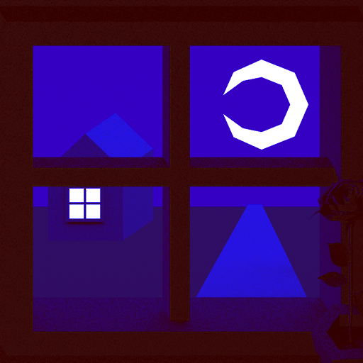
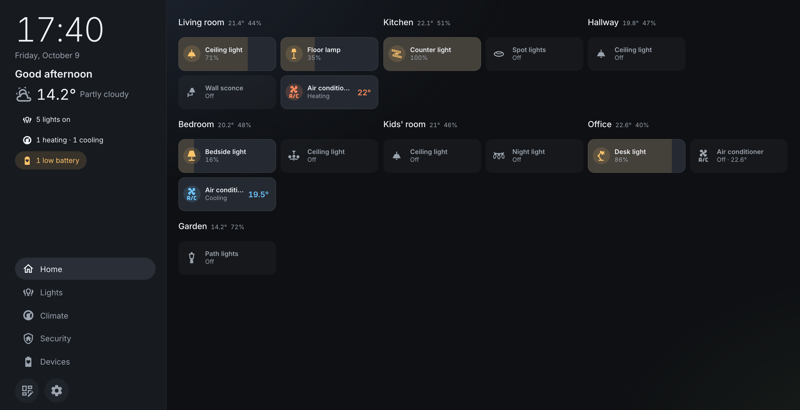

<p align="center">
  
</p>

<h1 align="center">Doma</h1>

<p align="center">
  <a href="https://github.com/terjokhin/doma/releases/latest"></a>
  <a href="LICENSE"></a>
</p>

<p align="center"><b>A calm, fast home screen for Home Assistant</b><br />for the wall tablet, the kiosk and the laptop</p>

<p align="center"><a href="https://terjokhin.github.io/doma/"><b>Try the live demo</b></a>: a made-up home in your browser, no Home Assistant needed</p>

<p align="center">
  
</p>

*Doma* is Russian for "at home". It's a static web app that talks to [Home Assistant](https://www.home-assistant.io/)
directly over its WebSocket API: no server of its own, no custom integration, nothing to install in HA.

## Why Doma

- **It builds itself.** Point it at Home Assistant and your home is there: rooms from your areas, in floor order,
  each with its lights, climate and switches. No dashboard YAML, no cards to configure, no entity IDs to copy.
- **It stays right as your home changes.** Layouts are bound to meaning ("this room's lights"), not to entity IDs,
  so a new device shows up in its room and a rename breaks nothing.
- **You arrange it on the screen itself.** Tap the edit button and drag rooms into rows, size them, rename them,
  hide what you don't need, pick what each card shows, and give every lamp, thermostat and switch an icon that says
  what it is: a ceiling light, a sconce, a floor lamp, an air conditioner, a kettle. No admin login: each HA user
  has their own layout, and every screen logged in as that user picks up a change at once.
- **Fast on a 2017 tablet.** Built and measured on a Fire HD 10 with Chrome 108: about 72 KB of gzipped JavaScript, only
  the entities on screen are subscribed to, one update re-renders one tile, and going back to a screen takes about
  50 ms.
- **Calm.** A tile that's off is a faint shape; what's on is lit. Dim a light by dragging across its tile. Status
  chips speak only when something needs a look: "3 lights on", "Door open · Hallway", "2 offline".
- **Lenses: the whole house, one question.** Lights, Climate, Security and Devices show every room filtered to one
  thing, in the same arrangement as Home.
- **Nothing to break.** No dependency on Home Assistant's frontend internals, so an HA update can't break it. One
  small Docker image for amd64, arm64 and a Raspberry Pi.
- **Touch-first**, with large tap targets and no hover-only controls. English and Russian; translations live in
  `src/i18n/*.json`.

## Quick start

Doma runs as a small Docker container on any machine on your network (a NAS, a Raspberry Pi, the box next to Home
Assistant), and any browser on the network opens it: a wall tablet, a laptop.

1. **Give your screens their own Home Assistant user.** In HA, open **Settings → People → Add person**, name it
   (say, "Wall panel"), turn on **Allow login**, choose a username and password, turn on **Can only log in from the
   local network** and leave **Administrator** off. Doma keeps its layout per HA user, so every screen logged in as
   this user shows the same Home, and a user that isn't an admin can't open HA's settings. HA has no per-entity
   permissions, though: this user can still switch every device.

2. **Run Doma**, telling it where Home Assistant is:

   ```sh
   docker run -d --name doma --restart unless-stopped -p 8080:8080 \
     -e HA_URL=http://homeassistant.local:8123 ghcr.io/terjokhin/doma:latest
   ```

   The image is for amd64, arm64 and arm/v7 (a Raspberry Pi); Docker picks the right one. Compose and the details
   are in [Running with Docker](#running-with-docker).

3. **Open `http://<docker host>:8080`** on the screen. Doma sends you to Home Assistant's own sign-in page: log in
   as the user from step 1, and you're on Home. The edit button arranges it; a wall tablet has its own tips in
   [Running on a wall tablet](#running-on-a-wall-tablet).

4. **Keep it up to date.** The latest version is on the chip at the top of this page and on the
   [releases page](https://github.com/terjokhin/doma/releases), with what changed. To update:

   ```sh
   docker pull ghcr.io/terjokhin/doma:latest
   docker rm -f doma    # then run step 2 again
   ```

   To stay on one version instead, use its tag, such as `ghcr.io/terjokhin/doma:0.1.0`; `:0.1` follows its fixes.

## Running from source

```sh
npm install
npm run dev            # http://localhost:5173 (also on your LAN, for a tablet)
```

Open the app, enter your Home Assistant URL and log in on HA's own sign-in page.
The app keeps HA's refresh token in the browser's local storage; it never sees your password.
To skip the URL prompt, copy `.env.example` to `.env.local` and set `VITE_HA_URL`.

**No Home Assistant at hand?** Open <http://localhost:5173/?fixture=demo>, or the [live demo](https://terjokhin.github.io/doma/).

**Devices your home doesn't have?** `docker compose -f compose.demo-ha.yaml up -d` starts a Home Assistant with its
demo integration at <http://localhost:8124>. Onboard it, make a long-lived token (Profile → Security) and put HA_URL
and HA_TOKEN into `.env.hademo`; `node --env-file=.env.hademo docker/demo-ha/seed-areas.mjs` puts its devices into
floors and areas (Doma's rooms are areas). Then capture it:
`node --env-file=.env.hademo scripts/capture-fixture.mjs local-hademo`, and open `?fixture=local-hademo`. `down -v`
instead of `up -d` throws it all away.

## Browser support

Chrome / Android WebView **108+**, Safari 16+, Firefox 115+. The oldest target is the WebView of
a 2017 Fire HD 10 (Fire OS 5), which is Chrome 108. Not available there, so not used:
CSS `color-mix()` and `oklch()`, `Array.prototype.toSorted()` and other ES2023 built-ins, the
Wake Lock API. `tsconfig.json` uses the ES2022 library, so newer built-ins fail the type check.
[ROADMAP.md](ROADMAP.md) has the performance budgets and what was measured on that tablet.

## Developing against a snapshot

Designing against live HA flips real lights. A fixture is a snapshot of states and registries
that the app runs on instead; toggles only change the snapshot in memory.

```sh
HA_URL=http://homeassistant.local:8123 HA_TOKEN=<long-lived token> npm run fixture:capture
# then open http://localhost:5173/?fixture=local
```

`fixtures/local*.json` is git-ignored and never included in a production build: it describes
a real home. `fixtures/demo.json` is a made-up home.

## Testing on a tablet

`npm run dev` listens on your LAN, so a tablet can open `http://<your-computer's-ip>:5173`
over Wi-Fi (no USB needed). If it can't connect, check your computer's firewall.

- **Device probe**: open `/probe.html` on the tablet. It reports the browser version, which
  features it supports and how fast it renders, and saves the result to `.probe/` on your
  computer. Run it inside the kiosk browser you'll use: that's the engine that counts.
- **Debug overlay**: add `?debug` to the app URL for FPS, slow frames, update and screen-change
  timings and the number of subscribed entities. Against the dev server it also posts a report
  every 5 seconds, including any JS errors, which the dev server prints and saves to
  `.probe/perf-*.jsonl`. `?debug&subscribe=all` subscribes to every entity instead, for
  comparison. The overlay is a separate 1 KB chunk, loaded only with `?debug`.
- Between device tests, Chrome DevTools with 6× CPU throttling is a rough stand-in.

## Running with Docker

The image serves the app with an unprivileged nginx on port 8080. Tell it where Home Assistant is with `HA_URL`;
it's read when the container starts, so one image works with any HA. Each release has an image for amd64, arm64
and arm/v7 (a Raspberry Pi) on GitHub's container registry:

```sh
docker run -d --name doma --restart unless-stopped -p 8080:8080 \
  -e HA_URL=http://homeassistant.local:8123 ghcr.io/terjokhin/doma
```

or with Compose:

```yaml
services:
  doma:
    image: ghcr.io/terjokhin/doma
    ports: ["8080:8080"]
    environment:
      HA_URL: http://homeassistant.local:8123
    restart: unless-stopped
```

To build it yourself instead, `docker build -t doma .` (with the same type check and size budget as
`npm run build`), and use `doma` as the image.

Then open `http://<docker host>:8080` and log in on HA's own page. Without `HA_URL` the app asks for the address,
as it does in development. Nothing needs changing in Home Assistant: it accepts Doma's address as the login's
client. Serve Doma over HTTPS only if Home Assistant is on HTTPS too; a browser blocks an HTTPS page from talking
to an HTTP one.

How it works: the page loads `config.js` before the app; the container's start script
(`docker/40-doma-config.sh`) writes `HA_URL` into it, and `nginx` never lets browsers cache it or the page, while
the hashed assets are kept for a year. A build-time `VITE_HA_URL` still works when there's no `HA_URL`.

Releases: pushing a version tag (`git tag v0.3.0 && git push origin v0.3.0`) runs `.github/workflows/release.yml`,
which pushes the image as `ghcr.io/terjokhin/doma:<version>`, `:<major>.<minor>` and `:latest` (not for a
pre-release such as `v0.3.0-rc.1`) and makes a GitHub release with notes on how to run it. The tag is the only place
the version is written: `package.json` says `0.0.0-dev`, and the image build sets the tag's version into it
(`--build-arg VERSION=…`), so the app shows it at the bottom of its settings. The same tag runs
`.github/workflows/demo.yml`, which builds the app on the made-up demo home (`VITE_FIXTURE=demo`, with no log-out in
its settings) and publishes it as the [live demo](https://terjokhin.github.io/doma/) on GitHub Pages; it can also be
run by hand from the Actions tab.

## Running on a wall tablet

1. Serve the app on your network: with Docker (above), or build it (`npm run build`) and serve `dist/` from any
   static web server.
2. Install [Fully Kiosk Browser](https://www.fully-kiosk.com/): full screen, screen always on,
   launch on boot, optional wake on motion. Its settings are behind a swipe from the left edge
   of the screen (**Settings → Web Content Settings → Start URL**).
   - **Old Android / Fire tablets**: current Fully needs Android 6+. The last version for
     Android 5 (Fire OS 5) is **1.59.2**, available as an APK in the download section of
     fully-kiosk.com. On Fire OS 5, enable **Settings → Security → Apps from Unknown Sources**,
     download the APK in Silk and open it from the Docs app (**Local Storage → Download**).
   - Fully renders with the system WebView, not with Silk or Chrome, so check its version with
     `probe.html` inside Fully.
3. Give the panel its own Home Assistant user, as in [Quick start](#quick-start). HA has no
   per-entity permissions: the user can control every entity, so use Fully's kiosk lock to keep
   people inside the app. The panel stays logged in through its refresh token. Optionally, HA's
   `trusted_networks` auth provider can log in the tablet's IP without a password.
4. Old Android devices (5.x) don't trust current Let's Encrypt certificates. On a home network,
   plain `http://` to Home Assistant avoids that.

## Screens and navigation

- **Home**: one card per room, in rows you arrange.
- **Room** (`#/room/<area>`): everything in one room, as cards like Home's: Scenes, Lights, Climate, Switches,
  Media, Sensors, in the rows and sizes the room template says.
- **Lenses** (`#/lens/lights`, `climate`, `security`, `devices`): one function across the house: Home filtered,
  the rooms in Home's rows and sizes, each showing what the lens picked. Lights: every light, with all on / off per room and for the house. Climate: air
  conditioners, heaters and thermostats, heating switches, each room's temperature, humidity and CO₂. Security:
  doors, windows, leak, smoke and gas sensors, locks. Devices: devices that are offline, and battery levels,
  lowest first.

On a wide screen (a tablet in landscape, a laptop) a **sidebar** at the left holds the clock, the date, the
weather, the **status chips**, which appear only when there's something to say (each opens its lens), and the
**tabs** (Home, then the lenses you chose, in your order). On a tablet in portrait they're under the home header
instead, and on a phone the tabs move to a bar at the bottom. A room's back button returns to where you came from. Home and the lenses that are tabs
stay built once visited, so going back to one is quick even on a slow tablet. The design behind the views:
[ROADMAP.md](ROADMAP.md#views-and-navigation).

## Layouts

The home screen shows each room as a card: its name, temperature and humidity, and
its controls (lights, climate), with "+N" for what doesn't fit. Rooms go in rows: a room on its own, or a stack of
rooms side by side. A card's size is its width: S, M (the default), L or the whole row; it's as tall as its tiles,
up to three rows of slim tiles, two cells wide, like Apple Home's. The icon switches a device, the rest of the tile
opens its controls, and dragging across a light's tile dims it. Tapping a card's title opens the room. Everything is placed on a grid of square cells that adapts to
the screen and reflows on rotation; the rules are in [LAYOUTS.md](LAYOUTS.md).

The layout is generated from your HA floors and areas, and a **home layout** adjusts it: Home's rows of room
cards and their sizes. It only stores those changes, so new rooms still appear by themselves. Each HA user has
their own, stored in Home Assistant itself (`frontend/set_user_data`, key `doma.layout`): any user can save
theirs, no admin login needed, and every screen logged in as that user picks up a change at once. To change it,
tap the **edit button** (at the bottom left of the sidebar on every screen, or in the screen's header on a narrower
one): drag a card by its title onto another card to stack them side by
side, or onto **+ New row** between rows for a row of its own. Tap a room to select it: the bar at the bottom renames it (in Doma only; HA's
area keeps its name), sets its width (S, M, L or the whole row), gives it its own row or hides it (**Hidden rooms** brings them back), and the
card itself sets what it shows (**+** adds a control, × removes one, drag one to move it, tap one to swap it or
give it an icon; lights, switches, climate, scenes and an all-lights button); pick and order the tabs under
**Tabs**, then **Done**.
At first each floor's rooms share a row; there are no floor headings.

Room screens and lenses are arranged the same way. A room screen's cards are its sections, and follow a **room
template** stored in the same layout: tap a section's title to rename, size or hide it, drag it by its title to
stack it or give it a row, either for every room or for this room only. Tap a tile to hide it on this room's
screen or, for a light, a thermostat or a switch, to give it an **icon** that says what it is (a ceiling light, a
sconce, an air conditioner, a kettle…); HA's own icon is the starting point, and the choice shows everywhere. A lens's cards are Home's rooms, so arranging them there arranges Home too. The format is in [LAYOUTS.md](LAYOUTS.md#layout-model).

## Architecture

How the screen is divided into cells, how boards of cards are laid out, and how elements are sized: [LAYOUTS.md](LAYOUTS.md).

```
src/
  ha/         connection (OAuth + WebSocket, or a fixture), subscriptions and the store
  model/      HA registries → floors → rooms → lights / climate / sensors …; lenses
  layout/     the cell grid, boards (cards in rows), the home layout and its editor
  ui/         tiles, header, sidebar, navigation band, icons, formatting
  screens/    Home, Room, Lens, Setup
  i18n/       en.json is the source; other languages translate it
  debug/      performance counters and the ?debug overlay
  styles/     design tokens + styles (dark first, no heavy blur effects)
```

- **UI**: [Svelte 5](https://svelte.dev/) with plain CSS. `npm run build` type-checks, builds and
  fails if the JavaScript loaded on start exceeds 100 KB gzipped.
- **Connection**: [`home-assistant-js-websocket`](https://github.com/home-assistant/home-assistant-js-websocket),
  the library HA's own frontend uses, for auth, token refresh and reconnects.
- **Subscriptions**: each component declares the entities it shows (`watchEntities`), and the
  app subscribes to exactly that set with `subscribe_entities` and an `entity_ids` filter. The
  library's own `subscribeEntities()` can't filter, so the app sends the message itself and
  decodes HA's compressed updates (`ha/entities.ts`). Screens kept built (below) keep their entities. On
  navigation, the new subscription starts before the old one stops. An empty list is never sent: HA reads it as "everything".
- **Store**: registries, plus a reactive state per entity (`home.entity(id)`), so a sensor
  update re-renders one tile, not the screen.
- **Model**: rooms come from HA areas and floors, built from the registries and one `get_states`
  snapshot (loaded at start and after registry changes), not from live updates. An entity's
  area is its own, or else its device's. Hidden and config/diagnostic entities are left out.
  `switch` entities whose ID names a light (`…_light`, `…_lamp`, `…_sconce`) count as lights, and those that
  name a heater (`…_heating`, `…_heater`, `…_radiator`, `…_boiler`) show on room cards and in the Climate lens. For the Devices
  lens, each device in a room is checked through one of its entities (all of them go unavailable when it's
  offline) and its battery, which is usually a diagnostic entity the room screen leaves out.
- **i18n**: a tiny `t()` over the JSON files, with i18next-style `{{name}}` and plural keys
  (`_zero`, `_one`, `_few`, `_many`, `_other`).
- **Routing**: hash-based (`#/`, `#/lens/lights`, `#/room/kitchen`), so the build can be served from any path.
- **Screens kept built** (`App.svelte`): Home and the tab lenses stay mounted once visited, stacked in one grid
  cell, each on its own layer. A hidden one is transparent and has no height, so showing it again changes only
  opacity: no new layout or paint. They stay up to date while hidden, so anything they derive from live states
  should change only when what they show changes (a lens keeps its view while it's the same; chips are computed
  once for every screen).
- **Rendering on weak hardware**: no backdrop blur or large shadows; tiles and cards use CSS
  `contain`; full-screen effects sit on their own fixed layer, so scrolling and screen changes
  don't repaint them.

## Development notes

- `npm run typecheck` runs `svelte-check`. TypeScript is pinned to 6.x, because `svelte-check`
  doesn't support TypeScript 7 (the native compiler) yet.
- Don't add UI component or animation libraries; check `npm run build`'s size report when adding
  any dependency.

## Status

Early. See [ROADMAP.md](ROADMAP.md) for where it stands, the target devices
and the performance budgets.

## License

Copyright © 2026 Alexey Terekhin and contributors.

Doma is free software: you can redistribute it and/or modify it under the terms of the
[GNU General Public License](LICENSE) as published by the Free Software Foundation, either version 3 of the License,
or (at your option) any later version. In short: use it, change it and share it freely; a changed version you pass
on stays open under the same license.

It's distributed in the hope that it will be useful, but without any warranty; see the license for details.
